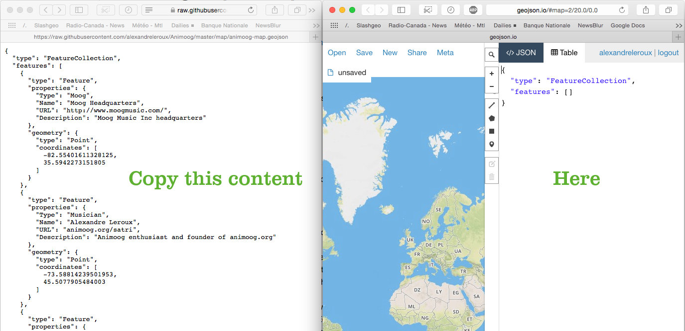
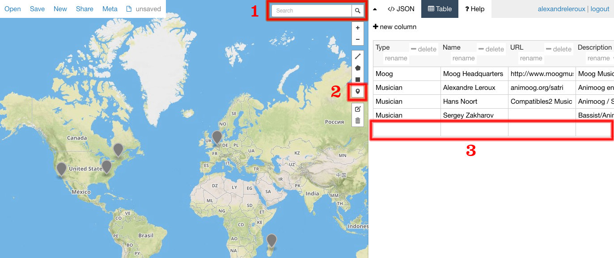
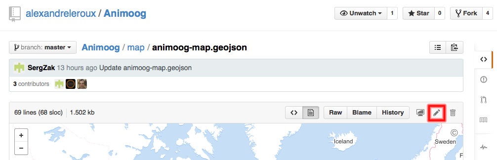
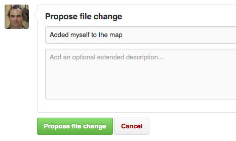
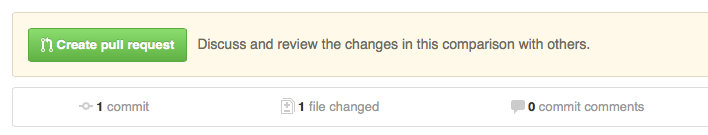

The interactive map is here: <a href="https://github.com/alexandreleroux/Animoog/blob/master/map/animoog-map.geojson" target="_blank">github.com/alexandreleroux/Animoog/blob/master/map/animoog-map.geojson</a>

Animoog Players Map - Instructions for Contributing
============================================

This map is for the <a href="http://animoog.org/map" target="_blank">Animoog Players Map - animoog.org/map</a>, everyone is welcomed to contribute to it.

Use cases
---------

* Find Animoog players and fans near you and meet to share tips and tricks, and maybe even jam together?
* Find Moog-related stores around you
* Maps are fun!

Adding yourself to the map
--------------------------

Map data, such as the location of Animoog players and Moog dealers, can be stored in a GeoJSON file. This file format is <a href="https://help.github.com/articles/mapping-geojson-files-on-github" target="_blank">automatically displayed over a map by GitHub</a>.

Adding yourself to the file that contains the map data:

1. Register and login to <a href="http://github.com" target="_blank">GitHub</a> - this step is necessary to avoid spam on the map
2. In a second browser tab, open the <a href="http://geojson.io" target="_blank">geojson.io</a> website
3. Copy the <a href="https://raw.githubusercontent.com/alexandreleroux/Animoog/master/map/animoog-map.geojson" target="_blank">raw animoog-map.geojson</a> content to the geojson.io website in its '</> JSON' tab 
4. Click on the 'Table' tab to edit the map content using the 'Table' view:
  1. Add new members by searching for its location (the magnifying glass icon) and then clicking the pushpin to place the marker on the map
  2. Add corresponding text and links in the Table view 
5. Go to the <a href="https://github.com/alexandreleroux/Animoog/blob/master/map/animoog-map.geojson" target="_blank">animoog-map.geojson file</a> page and click 'Edit this file' (the little pen icon), copy your improved geojson from the '</> JSON' tab on geojson.io and copy this content to members-map.geojson on GitHub 
6. Indicate what you added or changed in the 'Propose file change' box and click the 'Propose file change' button 
7. On the 'Comparing changes' page that loaded, click on 'Create pull request' 

Bravo, you're done! Once I'll accept your changes, the map will be updated and all other players will see the improvements you've done.

Warning
-------

PRIVACY warning: 
* Please add only yourself and Moog-related stores 
* Don't use the precise location of your home, you are responsible for the location accuracy and your associated privacy

Symbols and colors
-----
<a href="https://www.mapbox.com/maki/" target="_blank">Maki symbols</a> can be displayed directly on GitHub maps. Symbols and colors used on the map:

* Animoog players use the music notes icon  in the green color (#32CD32)
* Animoog sound designers (presets and timbres) can use the chemist icon  in the light purple color (#AD85FF), if you find another Maki icon is more suitable, let us know
* Moog headquarters use the industrial symbol  in the orange color
* Orange (#FFA500) is the color for official Moog markers, such as headquarters and Moog staff
* Moog dealers and stores will use the commercial icon  in the light blue color (#66CCFF)

Ideas?
-----

If you great ideas to improve this map? [Let us know in the issues](https://github.com/alexandreleroux/Animoog/issues)!
